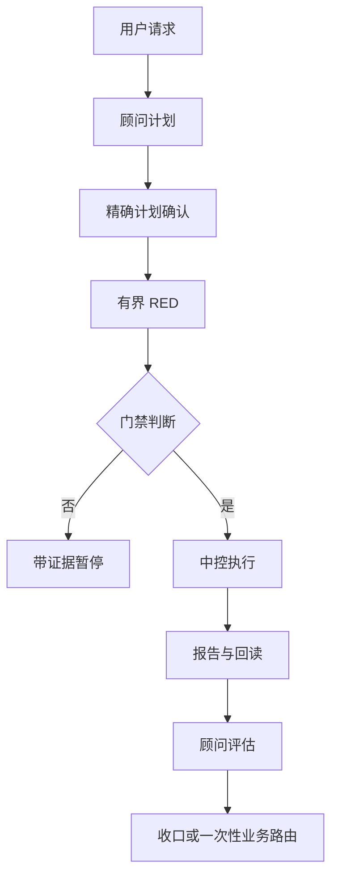

# CO-OP Loop

简体中文 | [English](README.en.md)

**一个给多 Agent 协作场景准备的轻量治理协同环。**

CO-OP Loop 是一个面向 Codex 长周期工作的 Skill：把计划确认、角色边界、
RED 审计、执行证据和回读收口放进一个可复核的最小协议里。它的设计哲学是：
**把治理做厚，把交互做薄**。

当前公开版本为 **v0.2.0**，采用 MIT 许可证。Public GitHub 仓库与
`v0.2.0` Release 已存在。当前验证证据覆盖本地 Codex 与 Windows 公开
clone canary；Claude、其他宿主和其他操作系统仍是**未验证**。

## 它解决什么问题

自动化可以减少机械劳动，却也可能让人感觉自己成了人工 API。计划仍然可能被
误解，权限边界可能被悄悄扩大，而看似成功的回复也可能缺少完成证据。CO-OP Loop
用小而清晰的协议、角色和证据链，让这些摩擦保持可见：

- 顾问接收用户的业务请求并维护计划；
- 中控任务执行已经获得授权的工作；
- 一次性业务任务只用于收口后的具体业务动作，并且只有在用户选择它、所有门禁
  仍然满足时才会执行。



## 触发与首次使用

只有整条输入精确匹配以下形式时才触发：

```text
loop
/loop
$loop
$co-op-loop
```

空白和大小写会被规范化；仅在句子中包含这些词，不会触发 Skill。

首次使用时，Skill 会检查已保存的本地项目关联，运行只读存储预检，确认本地任务
能力，绑定顾问与中控角色，并且只在角色 ID 已知且验证通过后写入七字段状态。
中控任务不是顾问任务。

日常交互保持简短：顾问接收请求、展示当前计划、收集精确确认，并在 RED 与高风险
门禁通过后，把完整执行包路由给已验证的中控任务。顾问不直接执行业务计划。

## RED、授权与完成证据

RED 是审计阶段，不是实现阶段。正式结果只有 `RED_ALL_PASS` 或
`CHANGES_REQUIRED`。

- 首次精确确认绑定一个具体计划版本；
- RED 通过不会扩大原始授权；
- 正常流程最多三次完整 RED；
- 三次仍未通过时，需要独立最终风险审计和用户路由，不会自动取得第四次执行授权；
- 测试与报告必须区分 `PASS`、`FAIL`、`BLOCKED`、`NOT_RUN` 和 `NOT_AUTHORIZED`。

“命令成功”不等于“任务完成”。中控必须留下报告，说明读取、修改、未运行项、
风险和后续步骤，顾问才能独立回读。

## 存储适配与七字段状态

存储适配器依据有限的本地治理证据分别解析状态路径和报告根，不根据猜测的 Git
根添加 locator。严格项目只能使用明确授权的状态/报告安全对；普通项目只有在
权威规则明确指定并且目录已存在时才能复用正式报告根；单独存在一个 `reports`
目录并不足以授权。旧的 `.coop-loop` 配对不会静默迁移。

状态严格包含七个字段：

```yaml
project_root: <project-root>
initialized_at: <timestamp>
consultant_thread_id: <consultant-id>
control_thread_id: <control-id>
phase: READY
red_count: 0
updated_at: <timestamp>
```

示例中的 ID 是占位符，不是真实任务 ID。`phase` 是协议接受的值，`red_count`
范围为 0 到 3。每次写入都必须独立回读。

## 仓库结构与安装

公开仓库根是这个 `src/` 目录；运行时 Skill 是其中的 `co-op-loop/` 子目录，
仓库文档放在运行时目录之外。全局安装只安装运行时目录。

```text
src/
├── co-op-loop/              # runtime Skill
├── docs/                    # repository documentation
├── tools/                   # repository maintenance tools
└── .github/                 # repository maintenance templates
```

## 本机安装与验证

将 `co-op-loop/` 目录复制到宿主本地 Skill 目录后，先验证复制的目录再使用。
宿主路径因环境而异，不要在仓库中公开个人路径。

典型的本机验证会关闭 Python 字节码写入。`<path-to-co-op-loop>` 必须替换为复制后的
exact runtime 目录：

```powershell
$env:PYTHONDONTWRITEBYTECODE = "1"
$env:PYTHONUTF8 = "1"
python -X utf8 -B <path-to-co-op-loop>/scripts/scenario_tests.py
```

如果宿主提供 Skill Creator，可额外调用宿主自带的 `quick_validate.py` 校验 runtime；
它不是本仓库脚本，路径由宿主决定，仅作为可选检查。

升级前先比较源码与目标文件，只替换由当前安装方拥有的运行时 Skill。卸载前必须
满足宿主自身的所有权与回滚规则。本仓库不因本地验证自动授权删除、迁移或外部同步。

## 当前验证边界与限制

当前证据目标是本地 Codex 行为以及 Skill 的静态协议/存储逻辑。Claude 和其他
宿主仍是**未验证**，不能把静态检查说成宿主发现、任务创建、跨任务通信或生产
运行证据。

协议无法提供顾问与中控之间的操作系统级权限隔离；它提供的是工作流边界和证据
合同。用户仍需审阅计划、权限范围和最终报告。

## 贡献与安全

使用 Issue 表单提交可复现的 bug、兼容性报告和功能建议。提交诊断信息前请阅读
[CONTRIBUTING.md](CONTRIBUTING.md) 与 [SECURITY.md](SECURITY.md)。Issue 中不得
包含凭证、Cookie、私钥、本机状态或私有项目路径。

- [English README](README.en.md)
- [中文长篇项目介绍](docs/why-co-op-loop.zh-CN.md)
- [变更记录](CHANGELOG.md)
- [MIT License](LICENSE)

当前公开版本为 `v0.2.0`；后续修改仍应在完成相应验证后再提交。
