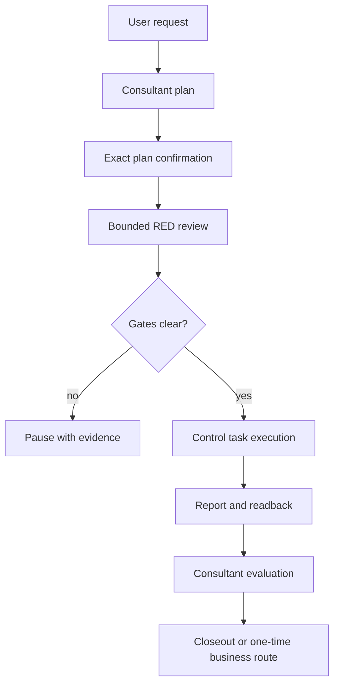

# CO-OP Loop

**A lightweight governance loop for multi-agent work.**

CO-OP Loop is a Codex-oriented Skill for long-running work that needs clear
roles, bounded review, explicit authorization, and evidence that can be read
back later. It is designed to make governance thorough while keeping ordinary
interaction small: **make governance thick, keep interaction thin**.

This repository candidate is version **v0.2.0** and is licensed under the MIT
License. It is a local, pre-publication candidate; a successful local check is
not a GitHub release or a production authorization.

## Why it exists

Automation can reduce mechanical work while making people feel like a manual
API. A plan is still easy to misunderstand, a permission boundary can be
silently widened, and a green-looking response can hide missing evidence.
CO-OP Loop keeps those risks visible with a small protocol:

- a consultant receives the user's business request and maintains the plan;
- a control task performs the authorized work;
- a one-time business task is used only for a concrete action after closeout,
  when the user selects it and all gates remain satisfied.



## Trigger and first use

The exact whole-input activation forms are:

```text
loop
/loop
$loop
$co-op-loop
```

Whitespace and letter case are normalized. A sentence that merely contains
one of these words does not activate the Skill.

On first use, the Skill checks the saved local project association, runs a
read-only storage preflight, confirms local task capability, binds the
consultant and control roles, and writes the seven-field state only after the
role IDs are known and verified. The control task is not the consultant task.

Daily use is intentionally short. The consultant can receive a request,
display the current plan, collect the exact confirmation, and route the
complete package to the verified control task after RED and high-risk gates
are clear. The consultant does not perform the business plan itself.

## RED and authorization

RED is a bounded audit, not an implementation phase. A reviewer may return
`RED_ALL_PASS` or identify a concrete blocker with `CHANGES_REQUIRED`.

- The first exact plan confirmation binds one plan version.
- A RED pass does not widen the original permissions.
- The normal process has at most three complete RED submissions.
- After three unresolved submissions, an independent final risk audit and a
  user route are required; it is not an automatic fourth execution approval.
- Tests and reports must distinguish `PASS`, `FAIL`, `BLOCKED`, `NOT_RUN`, and
  `NOT_AUTHORIZED`.

Completion means more than a successful command. The control task must leave a
report, identify what was and was not changed, and preserve enough evidence
for the consultant to read back. A response without those facts is not proof
of completion.

## Storage and state

The adapter resolves state and report locations from finite local evidence. It
does not add a locator field to state and does not guess from a Git root.
Strict projects use only an explicitly authorized state/report pair. Ordinary
projects may reuse one existing formal report root when the project's exact
governance rule authorizes it; a directory named `reports` alone is not enough.
Legacy `.coop-loop` pairs remain paired and are never silently migrated.

The state contract has exactly seven fields:

```yaml
project_root: <project-root>
initialized_at: <timestamp>
consultant_thread_id: <consultant-id>
control_thread_id: <control-id>
phase: READY
red_count: 0
updated_at: <timestamp>
```

The IDs above are placeholders, not real task IDs. `phase` is one of the
protocol's accepted values and `red_count` is bounded from 0 through 3.
Every state write must be independently read back.

## Package layout

The future repository root is this `src/` directory. The runtime Skill is the
`co-op-loop/` subdirectory; repository-facing documents stay outside it.
Only the runtime Skill is installed into a Codex Skill directory.

```text
src/
├── co-op-loop/              # runtime Skill
├── docs/                    # repository documentation
├── tools/                   # repository maintenance tools
└── .github/                 # repository maintenance templates
```

## Local installation and validation

Copy the `co-op-loop/` directory into the host's local Skill directory, then
validate the copied directory before using it. The exact host path is
environment-specific; do not publish a personal path in a repository.

Typical local validation uses Python with bytecode disabled:

```powershell
$env:PYTHONDONTWRITEBYTECODE = "1"
$env:PYTHONUTF8 = "1"
python -X utf8 -B scripts/quick_validate.py <path-to-co-op-loop>
python -X utf8 -B <path-to-co-op-loop>/scripts/scenario_tests.py
```

Upgrade by replacing only an owned runtime Skill after comparing the source
and destination files. Uninstall by removing the installed copy only after
the host's own ownership and rollback rules permit it. This repository does
not authorize deletion, migration, publication, or external synchronization.

## Support boundary and limitations

The current evidence target is local Codex behavior and the Skill's static
protocol/storage logic. Claude and other hosts remain **unverified** until a
supported-environment test produces evidence. Static source inspection is not
the same as host discovery, task creation, bidirectional messaging, or a
production run.

The protocol cannot provide operating-system permission isolation between a
consultant and a control task. It provides a workflow boundary and explicit
evidence contract. Users must still review the plan, the authorization scope,
and the final report.

## Contributing and safety

Use the issue forms for reproducible bugs, compatibility reports, and feature
requests. See [CONTRIBUTING.md](CONTRIBUTING.md) and [SECURITY.md](SECURITY.md)
before sharing diagnostics. Never include credentials, cookies, private keys,
local state, or private project paths in an issue.

- [Chinese README](README.zh-CN.md)
- [Chinese project introduction](docs/why-co-op-loop.zh-CN.md)
- [Change log](CHANGELOG.md)
- [MIT License](LICENSE)

This candidate is ready for a separate publication review only after the
local validation report confirms the exact evidence for the current build.
