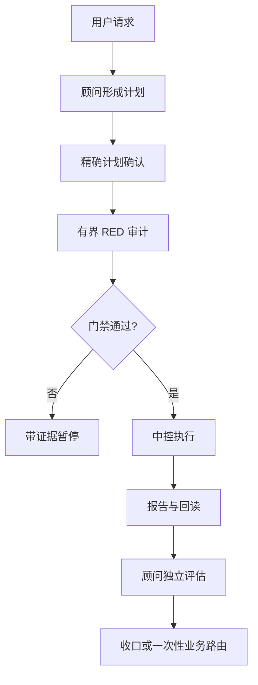

# CO-OP Loop

**一个给多 Agent 协作场景准备的轻量治理协同环。**

CO-OP Loop 是一个面向 Codex 长周期工作的 Skill：把计划确认、角色边界、
RED 审计、执行证据和回读收口放进一个可复核的最小协议里。它的设计哲学是：
**把治理做厚，把交互做薄**。

本候选包版本为 **v0.2.0**，采用 MIT 许可证。它是本地开源候选包，不等于
已经创建 GitHub 仓库、发布版本或获得生产授权。

## 它解决什么问题

模型自动化了，人的协作却可能变成一串人工 API：计划没有被真正确认，权限在
执行中被悄悄扩大，或者一个看似成功的回复没有留下可核对证据。CO-OP Loop
用三个角色和一条证据链降低这种摩擦：

- 顾问接收用户业务请求，维护计划并负责回读；
- 中控任务只执行已经授权的计划；
- 一次性业务任务只在收口后、用户明确选择且所有门禁仍满足时承接具体动作。



## 触发与首次使用

只有整条输入精确匹配以下形式时才触发：

```text
loop
/loop
$loop
$co-op-loop
```

首轮会先检查当前任务的本地项目关联，运行只读存储预检，确认本地任务能力，
再绑定顾问和中控角色。中控不是顾问任务；只有在角色 ID 已知、回读验证且计划
确认后，才允许写入七字段状态。

日常交互保持简短：顾问展示当前计划并收集精确确认，RED 和高风险门禁通过后，
把完整执行包路由给中控。顾问不直接执行业务计划。

## RED、授权与完成证据

RED 是审计阶段，不是实现阶段。正式结果只有 `RED_ALL_PASS` 或
`CHANGES_REQUIRED`。

- 首次精确确认绑定一个具体计划版本；
- RED 通过不会扩大原始授权；
- 正常流程最多三次完整 RED；
- 三次仍未通过时，需要独立最终风险审计和用户路由，不会自动取得第四次执行授权；
- 报告必须区分 `PASS`、`FAIL`、`BLOCKED`、`NOT_RUN` 和 `NOT_AUTHORIZED`。

“命令成功”不等于“任务完成”。中控必须留下报告，说明读取、修改、未运行项、
风险和后续步骤，顾问才能独立回读。

## 存储适配与七字段状态

存储适配器依据有限的本地治理证据分别解析状态路径和报告根，不根据猜测的 Git
根添加 locator。严格项目只能使用明确授权的状态/报告安全对；普通项目只有在
权威规则明确指定并且目录已存在时才能复用正式报告根；单独存在一个 `reports`
目录并不足以授权。旧的 `.coop-loop` 配对不会静默迁移。

状态严格包含七个字段：

```yaml
project_root: <project-root>
initialized_at: <timestamp>
consultant_thread_id: <consultant-id>
control_thread_id: <control-id>
phase: READY
red_count: 0
updated_at: <timestamp>
```

示例中的 ID 是占位符，不是真实任务 ID。每次写入都必须独立回读。

## 仓库结构与安装

公开仓库候选根是 `src/`；运行时 Skill 是其中的 `co-op-loop/`。README、变更记录、
Issue 模板和维护工具不进入运行时 Skill；全局安装只安装运行时目录。

```text
src/
├── co-op-loop/              # 运行时 Skill
├── docs/                    # 项目文档
├── tools/                   # 仓库维护工具
└── .github/                 # Issue 与 PR 模板
```

复制到宿主本地 Skill 目录后，应先做结构校验和场景回归。验证时建议关闭 Python
字节码写入：

```powershell
$env:PYTHONDONTWRITEBYTECODE = "1"
$env:PYTHONUTF8 = "1"
python -X utf8 -B scripts/quick_validate.py <path-to-co-op-loop>
python -X utf8 -B <path-to-co-op-loop>/scripts/scenario_tests.py
```

## 当前验证边界与限制

当前证据目标是本地 Codex 行为以及 Skill 的静态协议/存储逻辑。Claude 和其他
宿主仍是**未验证**，不能把静态检查说成宿主发现、任务创建、跨任务通信或生产
运行证据。

协议无法提供顾问与中控之间的操作系统级权限隔离；它提供的是工作流边界和证据
合同。用户仍需审阅计划、权限范围和最终报告。

## 入口

- [English README](README.md)
- [中文长篇项目介绍](docs/why-co-op-loop.zh-CN.md)
- [贡献指南](CONTRIBUTING.md)
- [安全说明](SECURITY.md)
- [变更记录](CHANGELOG.md)
- [MIT License](LICENSE)

本候选包只有在当前构建的本地验证报告完整、可回读后，才适合进入单独的 GitHub
发布授权审查。
