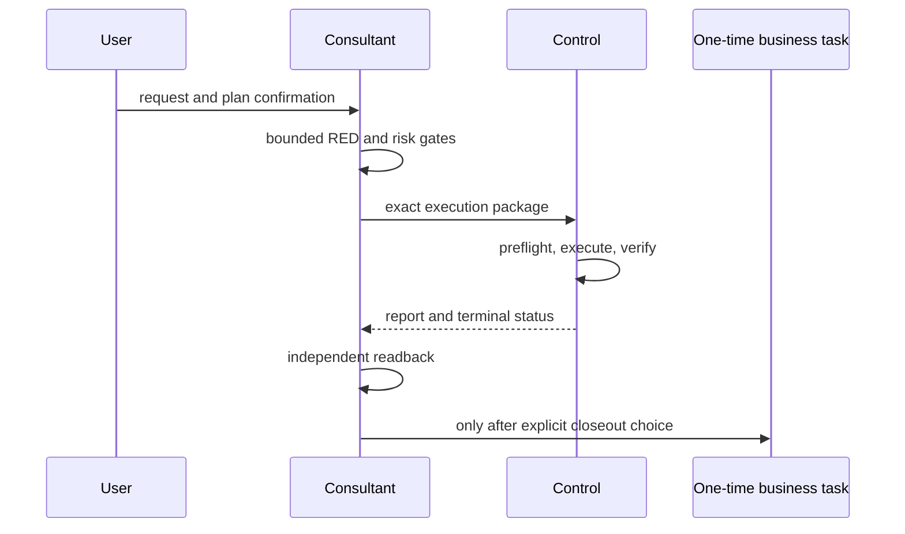

# 为什么是 CO-OP Loop

很多协作系统把注意力放在“能不能自动做完”。真正进入长周期、多角色、多阶段
工作之后，难题往往变成另一件事：谁在做决定，谁在执行，谁能证明这一步确实
发生过。

模型可以很快生成计划，也可以很快产生一段看似完整的回复。但速度不会自动
带来边界。没有明确确认，计划可能只是被路过；没有角色分工，顾问会直接变成
执行者；没有回读，成功消息可能只是文本上的假完成。

CO-OP Loop 选择了一条克制的路径：让治理更厚，让日常交互更薄。大多数时候，
用户只需要看到一个清楚的问题和一个精确的选择；复杂性留在协议、门禁和证据
里，而不是让每一次工作都变成会议。

## 三个角色，三种责任

顾问负责理解目标、组织计划、维护 RED 交换和独立回读。中控负责执行已经通过
授权和门禁的计划。一次性业务任务只承接一个具体动作，并且不拥有顾问或中控
身份。这样做不是为了制造更多窗口，而是为了让“形成判断”和“改变真实文件”
留下可区分的责任边界。

## 把“人工 API”变回协作

当模型把所有东西都自动串起来，人反而需要不断追问“现在在哪一步”“刚才谁
批准了什么”“哪些文件真的变了”。CO-OP Loop 把这些问题变成固定接口：

- 计划有 exact confirmation；
- RED 有清晰的通过与阻断语义；
- 高风险动作有 stop condition；
- 状态只有七个字段；
- 报告写明读取、修改、测试、未运行项和风险；
- 顾问必须独立回读，而不是复述中控的成功文本。

这套设计不承诺“永远正确”，也不把 Skill 说成操作系统权限隔离。它只承诺：
当证据不足或边界不安全时，系统应当能够停下来，并把不确定性交还给人。

## 产品边界

当前候选包面向本地 Codex 工作流。存储适配覆盖普通项目和有明确治理锚点的
严格项目；历史 `.coop-loop` 配对不会自动迁移。其他宿主的支持范围必须等待
真实环境证据，不能由静态文档推导。

版本 `v0.2.0` 是本候选包的公开软件版本标识。内部共识稿、私有项目路径、真实
任务 ID、状态文件、报告和凭证都不属于公开候选包。

## 后续方向

如果候选包通过独立发布审查，后续工作应继续保持同一原则：先明确公开边界，
再验证结构和行为，最后才讨论远端仓库动作。GitHub 建仓、提交、推送、Release
和线上 Issue 都是单独的授权动作，不会因为本地校验通过而自动发生。
